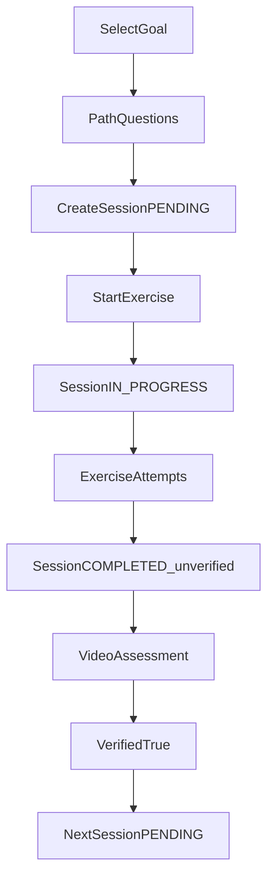

# User Flows

## F-01 Register → goal → questions → first PENDING workout

```text
Open app → Register (email + password)
  → Profile basics (optional)
  → Select goal skill (node) e.g. Muscle-Up
  → Onboarding questions generated from goal path
       e.g. How many Australian Pull-ups? / Can you do 5 Pull-ups?
  → Answers place UserNodes (no video yet)
  → System picks next focus workout (via workout.goal_node_id)
  → INSERT WorkoutSession status=PENDING, verified=false → return to client
  → Home shows this pending workout as “Next”
```

## F-02 Train a PENDING session

```text
Home → open PENDING WorkoutSession
  → Start first exercise
       → session.status = IN_PROGRESS, started_at = now()
       → INSERT ExerciseAttempt (session_id, workout_exercise_id, status=IN_PROGRESS)
  → Log sets/reps/rest → PATCH attempt → status=COMPLETED
  → Repeat for each workout_exercise line
  → When all attempts COMPLETED/SKIPPED
       → session.status = COMPLETED, completed_at = now()
       → session.verified still false
  → UI: “Verify this skill” (goal node of the workout)
```

## F-03 Verify → unlock next workout

```text
After session COMPLETED (unverified)
  → Record/upload video for workout.goal_node_id (required)
  → POST Assessment (node_id, workout_session_id, video)
  → status PENDING_REVIEW → admin/manual PASS
  → session.verified = true
  → UserNode for that node → COMPLETED
  → Unlock next node(s) via node_edge
  → INSERT next WorkoutSession PENDING for next focus workout
  → Home shows new pending workout
```

## F-04 Change goal

```text
Profile → pick new goal node
  → current_goal_node_id updated
  → Recompute path / optionally abandon open PENDING session
  → New questions or new PENDING workout as product rules say
```

## F-05 Browse skills

```text
All Skills → list with progress %
  → Tap node → desc, requirements, linked workout
```

## System flow


