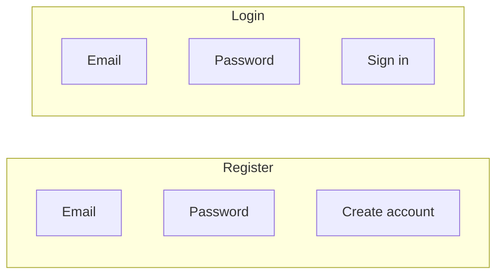
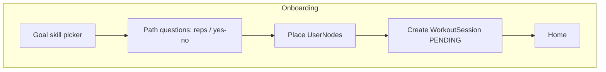

# Wireframes

Stupid-simple screen boxes. Not final UI.

## Auth



## Onboarding



## Home

```text
+----------------------------------+
| Good evening, Dave               |
| Goal: Muscle-Up                  |
|                                  |
| Next workout (PENDING)           |
| Pull Strength Beginner           |
| Focus skill: 10 Pull-ups         |
|                                  |
| [ Open workout ]                 |
|                                  |
| Nav: Home | Skills | Progress | Me |
+----------------------------------+
```

## Workout (active)

```text
+----------------------------------+
| Pull Strength Beginner           |
| Session: IN_PROGRESS             |
| 1. Scapular Pull  [done]         |
| 2. Pull-up        sets __ reps __|
| 3. Rows           …              |
| 4. Dead hang      …              |
|                                  |
| [ Complete workout ]             |
| → status COMPLETED, not verified |
+----------------------------------+
```

## After complete — verify

```text
+----------------------------------+
| Workout complete                 |
| Verify skill: 10 Pull-ups        |
| [ Record & submit video ]        |
| (unlocks next PENDING workout)   |
+----------------------------------+
```

## Skill explorer

```text
+----------------------------------+
| All skills                       |
| Australian Pull-up    100%       |
| ...                              |
| Chest To Bar           68%       |
| Muscle-Up              20% LOCKED|
+----------------------------------+
         |
         v
+----------------------------------+
| Chest To Bar                     |
| Desc / requirements              |
| Prereqs: 10 Pull-ups, Explosive  |
| Recommended workout: CTB Prep    |
| [ Train / verify when ready ]    |
+----------------------------------+
```

## Progress + history

```text
+----------------------------------+
| Goal: Muscle-Up                  |
| Progress: #####----- 54%         |
| Nodes verified: 5 / 11           |
| Current session: needs verify    |
|                                  |
| History                          |
| - Pull Strength Beg  COMPLETED   |
|   verified: yes/no               |
+----------------------------------+
```

## Profile

```text
+----------------------------------+
| Name / email                     |
| Height weight age gender         |
| Experience                       |
| Goal skill                       |
| [ Edit ] [ Delete account ]      |
+----------------------------------+
```
