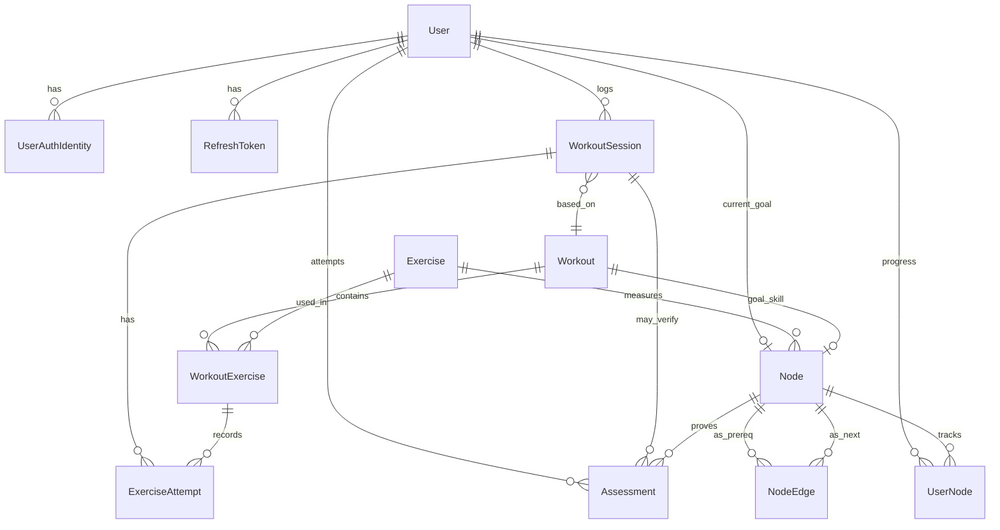

# Data Model

Tech-agnostic. Implementation: PostgreSQL (see `db-schema.md`).

## Entity groups

| Group | Entities | Mutability |
| --- | --- | --- |
| Identity | User, UserAuthIdentity, RefreshToken | Dynamic |
| Catalog | Exercise, Node, NodeEdge, Workout, WorkoutExercise | Static (admin/seed) |
| Progress | UserNode, Assessment | Dynamic |
| Training | WorkoutSession, ExerciseAttempt | Dynamic |

## Entities

### User

Athlete profile. Holds `current_goal` → Node. Password is **not** on User — see UserAuthIdentity.

### UserAuthIdentity

How the user signs in. V1: one `LOCAL` row (email + password hash). Ready for more providers later without reshaping User.

### RefreshToken

Hashed refresh token for session continuity and logout/revoke. Access JWTs are **not** persisted — see [ADR-011](../06-decisions/ADR-011-jwt-refresh-tokens.md).

### Exercise

Atomic movement (Pull-up, Dead Hang, Rows). Nodes and workout lines point here. Optional demo/thumbnail URLs for later.

### Node

A skill or measurable milestone on the learning path (First Pull-up, 10 Pull-ups, Muscle-Up). Linked to an Exercise + target metric (e.g. reps >= 10). Keeps its own `name`, optional `description`, and `difficulty`. Category lives only on Exercise — join via `exercise_id`.

### NodeEdge

Directed edge: **from_node = prerequisite**, **to_node = next skill** (bottom-up toward harder skills).

### Workout

Template aimed at a goal Node (e.g. “Chest To Bar Prep”).

### WorkoutExercise

Ordered line items inside a Workout (sets, reps, hold, rest).

### UserNode

Per-user state on a Node: locked / available / in progress / completed, progress %, verified flags.

### WorkoutSession

One assigned run of a Workout for a User. Created as `PENDING` when the system picks the next workout (after goal Q&A or after prior node verified). Moves to `IN_PROGRESS` when training starts, `COMPLETED` when all exercises are done. Stays **unverified** until a PASSED assessment on the workout’s goal node — only then unlock next `PENDING` session.

### ExerciseAttempt

Created when the user **starts** a line in the session (`IN_PROGRESS`), then `COMPLETED` / `SKIPPED` with logged sets/reps/rest.

### Assessment

Video proof for a Node (usually the completed session’s `workout.goal_node_id`). Links optionally to `workout_session_id`. Onboarding placement Q&A does **not** create assessments.

## Relationships



## Lifecycle

```text
Admin seeds Exercises → Nodes → NodeEdges → Workouts → WorkoutExercises
User registers → picks goal
  → Onboarding questions (from goal path) → answers place UserNodes
  → Create WorkoutSession PENDING (workout for next focus node)
User starts exercise → session IN_PROGRESS + ExerciseAttempt IN_PROGRESS
User finishes exercises → attempts COMPLETED → session COMPLETED (verified=false)
User submits Assessment video for workout.goal_node_id
  → PASS → session.verified=true, UserNode COMPLETED, unlock next
  → Create next WorkoutSession PENDING
```
