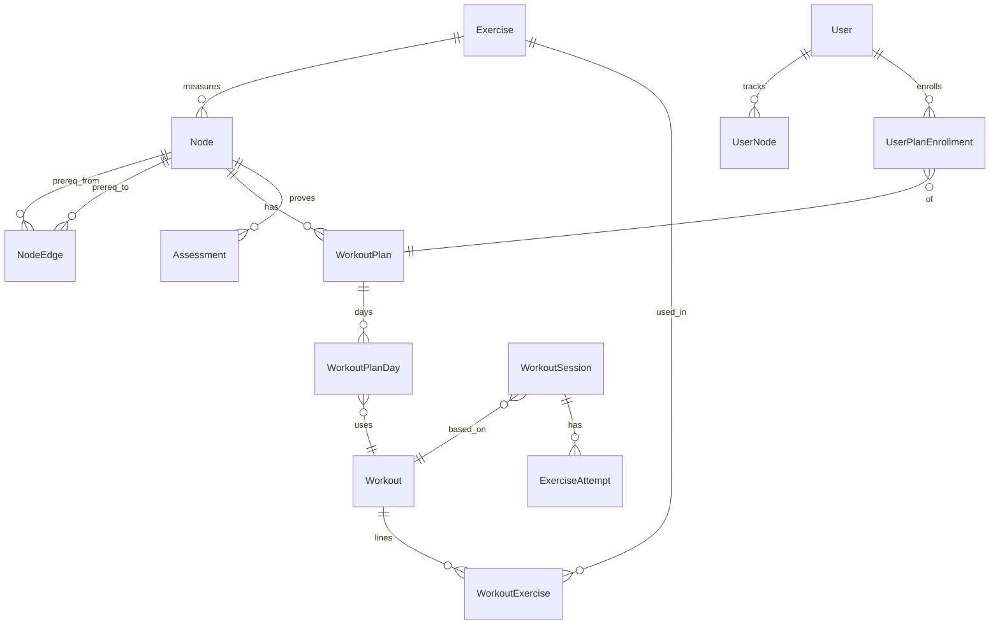

# Calisthenics Master Roadmap

A coach-grade deep-dive for building real skills, durable joints, a personal brand, and structured catalog data that feeds **Calistrack**.

**How to use this doc**

1. Start with **Module 1** (simple chapter teaching — read slowly, visualize in training).
2. Then Modules 2–3 (foundations → skill tree).
3. Build in public with Module 4 while you progress.
4. Seed Module 5 blueprints into Calistrack (`Node` / `Exercise` / `WorkoutPlan`) when a branch is ready.

**Calistrack alignment (short)**

| Coach idea                 | Calistrack entity                                                     |
| -------------------------- | --------------------------------------------------------------------- |
| Skill / milestone          | `Node` + `NodeEdge` (`PREREQUISITE`)                                  |
| Movement                   | `Exercise` (`category`, `metric_type`)                                |
| Multi-day prep for a skill | `WorkoutPlan` → `WorkoutPlanDay` → `Workout` → `WorkoutExercise`      |
| Proof of skill             | `Assessment` after enrollment `AWAITING_VERIFY`                       |
| User state                 | `UserNode`, `UserPlanEnrollment`, `WorkoutSession`, `ExerciseAttempt` |

---

# MODULE 1: Your Body Explained Like You're 10 (Then We Level Up)

> Read one **chapter** per day (or per week). After each chapter, do one workout and _look inside your body with your mind_ while you move. That is how this sticks.

**How to study this module**

1. Learn the **word** → the **real-life picture** → the **exercise example**.
2. Always ask: _What is the problem? What is the fix? What / why / how / when?_
3. While training, whisper the picture in your head (examples are written as **“Visualize:”**).

---

## Chapter 0 — The Big Picture (Your Body Is a Team)

Imagine your body is a **school project team**:

| Team member      | Simple name             | Job                             |
| ---------------- | ----------------------- | ------------------------------- |
| Brain + nerves   | The coach + phone lines | Sends “MOVE!” messages          |
| Muscles          | The workers             | Pull to create movement         |
| Tendons          | Strong ropes            | Connect muscle → bone           |
| Ligaments        | Door hinges tape        | Hold bone → bone (joint safety) |
| Bones            | The poles of a tent     | Give shape and levers           |
| Joints           | Door hinges             | Let bones bend/rotate           |
| Heart + blood    | Delivery bikes          | Bring oxygen + food to workers  |
| Food (nutrition) | Building bricks + fuel  | Repair and energize             |

**Problem:** If only muscles get strong but ropes (tendons) stay weak → ropes snap (pain/injury).  
**Solution:** Train smart, warm up, eat repair food, rest.

**Connected idea:** Every pull-up is _not_ “just arms.” It is coach → wires → back workers → ropes → bones → hinge → whole team.

---

## Chapter 1 — Basic Body Words (Learn These First)

### 1. Muscle

- **What:** Soft meat that can shorten (squeeze) and lengthen (stretch).
- **Real life:** Like a **rubber band** that can pull a toy car when it shortens.
- **Exercise:** In a pull-up, back + arm muscles shorten to lift you.
- **Visualize:** Tiny ropes inside the muscle grabbing and pulling hand-over-hand.

### 2. Bone

- **What:** Hard sticks that muscles pull on.
- **Real life:** Like **broom handles**. Muscles can’t move you without something stiff to pull.
- **Exercise:** Your arm bones are levers in a push-up.

### 3. Joint

- **What:** Place where two bones meet and move.
- **Real life:** A **door hinge**. If the hinge is rusty, the door squeaks (pain) or sticks (stiffness).
- **Examples:** Wrist, elbow, shoulder, hip, knee.

### 4. Tendon(related to movement, its injury called strain)

- **What:** Tough rope from muscle to bone.
- **Real life:** The **string on a kite**. Muscle = wind, bone = kite. String transfers force.
- **Problem:** Muscle gets stronger fast; string gets stronger slow → string gets angry (tendon pain).
- **Solution:** Slow lowers, easy hangs, patience (see Chapter 5).

### 5. Ligament(related to stability, its injury called sprain)

- **What:** Tape that holds bones together at a joint.
- **Real life:** Tape holding two sticks in a craft project.
- **Why care:** Bad form can yank the tape instead of using the muscle workers.

### 6. Scapula (shoulder blade)

- **What:** The flat bone on your upper back that your arm hangs from.
- **Real life:** Like a **joystick base**. If the base is floppy, the whole arm game feels shaky.
- **Exercise:** Scapular pull-ups = learning to move the joystick base on purpose.
- **Visualize:** Shoulder blades sliding into back pockets (down) or hugging the ribcage.

### 7. Core / midline

- **What:** Abs, deep trunk muscles, butt — the “middle brace.”
- **Real life:** The **walls of a cardboard box**. Soft walls → box collapses when you lift it.
- **Exercise:** Hollow body hold = bracing the box walls.
- **Visualize:** Zip your ribs toward your pants; become a stiff banana (hollow), not a floppy U.

### 8. Rep / set / hold

| Word | Meaning                  | Example               |
| ---- | ------------------------ | --------------------- |
| Rep  | One full movement        | 1 push-up             |
| Set  | A group of reps          | 8 push-ups, then rest |
| Hold | Stay still under tension | Hang for 20 seconds   |
| Rest | Pause so workers recover | 60–120 seconds        |

### 9. Form

- **What:** Doing the move with the _right body shape_.
- **Real life:** Writing letters neatly vs scribbling 100 messy letters. Messy doesn’t teach neat writing.
- **Rule:** Stop when shape breaks. Ugly reps teach ugly skills.

### 10. Leverage

- **What:** How “long” your body makes the hard job.
- **Real life:** Holding a backpack close to your chest is easy. Holding it with arms straight out is hard — same bag, longer lever.
- **Calisthenics:** Tuck front lever (knees in) → easier. Straight body → harder. Same skill family, harder lever.

---

## Chapter 2 — What Happens Inside When You Move?

### Problem

You do a push-up and only think “up-down.” You don’t know _who_ is working → you cheat, shrug, or hurt wrists.

### Solution

Learn the **message path**.

### The path (every rep)

1. **Brain decides:** “Do a push-up.”
2. **Nerves (phone lines)** carry the order to muscles.
3. **Motor units** wake up — a motor unit = one nerve wire + the muscle fibers it controls (like one light switch controlling a few bulbs).
4. **Muscle fibers shorten** → pull tendons → pull bones → you move.
5. **Blood delivers** oxygen + sugar fuel; waste products build up → burn feeling.
6. Tiny **damage marks** appear in muscle (normal if not extreme).
7. Later (sleep + food), body **repairs stronger**.

**Visualize (push-up):**  
Floor pushes your hands → wrists stacked like pillars → chest and triceps workers squeeze → shoulder blades hug ribs → abs brace the box → body rises as one plank.

**Visualize (pull-up):**  
Hands grip bar → lats (side-back wings) pull elbows down → biceps help → shoulder blades slide to pockets → chin clears bar → lower slow like a controlled elevator.

### Easy vs hard reps (fiber story)

- Easy reps = small “helper” workers.
- Hard / explosive / scary-hard = big “boss” workers wake up (more fast-twitch demand).
- **Why form matters:** If you kip and cheat, boss workers may wake up for the _wrong_ pattern — you practice the wrong dance.

---

## Chapter 3 — How Muscles Grow (Hypertrophy for Kids)

### Problem

“I did 100 push-ups every day but I don’t look stronger / don’t get skills.”

### Solution

Muscles grow from **good hard work + repair time + building food** — not from endless easy junk.

### Simple growth recipe

1. **Signal:** Hard tension (muscles working near their limit with clean form).
2. **Fuel:** Carbs help you train hard; protein helps rebuild.
3. **Repair:** Sleep is when the construction crew works.
4. **Repeat:** Week after week.

**Real life:** You can’t build a bigger LEGO tower by only dumping bricks on the floor. You need: stress the tower a bit (training), bring new bricks (protein), and give builders night time (sleep).

### Two growth vibes (simple)

| Vibe                   | Kid words                     | Calisthenics feel                  |
| ---------------------- | ----------------------------- | ---------------------------------- |
| Stronger cables inside | Fibers get thicker            | Hard sets, slow lowers, skills     |
| Fuller sponges         | Muscle stores more fuel/water | Volume, pumps — still need tension |

### Bodyweight special trick

In gym: add plates.  
In calisthenics: make the **lever longer** or assist less (band → less band → no band; tuck → straddle → full).

**When:** Hard strength sets 2–4×/week per pattern.  
**How long to see:** Strength often first (weeks). Visible shape often 6–12+ weeks if food + sleep help.

**Visualize after hard set:** Micro tears like tiny scuffs on a shoe sole → overnight the body patches them with thicker rubber → next month the sole is tougher.

---

## Chapter 4 — Your Physique: Why Some Bodies Look “Attractive”

Attractive calisthenics look is usually:

1. **Enough muscle** in shoulders, back, chest, arms, abs outline
2. **Not too much covering fat** (so shapes show)
3. **Posture + skill** (you _look_ athletic because you _move_ athletic)

### Problem

Only chasing abs while ignoring back/shoulders → flat look. Or only skills with no food → skinny-weak.

### Solution (balance)

| Goal piece           | Train                                    | Eat                              |
| -------------------- | ---------------------------------------- | -------------------------------- |
| Wider / 3D shoulders | Push-ups, dips, handstand work, rows     | Protein + enough calories        |
| V-taper back         | Pull-ups, rows                           | Protein                          |
| Visible midsection   | Hollow, leg raises + overall fat control | Not only crunches — food matters |
| Arms                 | Pull + dip strength                      | Protein                          |

**Real life:** A statue looks good because of _shape_, not because one finger is huge. Your “statue” is built by balanced push + pull + core + legs + body fat level.

**Truth:** Skills make you capable; food + recovery decide how much muscle shows. You can be skilled and still soft if calories are high — or skilled and flat if calories are too low forever.

---

## Chapter 5 — Tendons & Joints (The Slow Heroes)

### Problem

Muscles say “I’m ready for planche!” Tendons say “I’m still a thin rope.” You rush → elbow/wrist pain.

### Solution

Train tendons with **slow work** and **holds**, and progress levers only when joints feel quiet.

| Tissue         | Speed of getting stronger | Kid analogy                           |
| -------------- | ------------------------- | ------------------------------------- |
| Muscle         | Faster (weeks)            | Soft clay — reshapes quick            |
| Tendon         | Slower (months)           | Thick rope — needs many careful pulls |
| Skill in brain | Can be fast with practice | Learning a song                       |

### What / why / how / when

|          |                                                                                 |
| -------- | ------------------------------------------------------------------------------- |
| **What** | Dead hangs, scap pulls, slow negatives (3–5 sec lowers), easy leans, wrist prep |
| **Why**  | Make the ropes thick enough for hard skills                                     |
| **How**  | Mild burn OK; sharp joint pain = stop / regress                                 |
| **When** | Almost every session in warmup + 1–2 easy tendon sets on hard days              |

**Visualize:** Tendon like a phone charging cable. Yank it hard every day → breaks. Gentle daily use + slow strengthen → lasts years.

**Coach rule to remember while training:**  
_If muscle is fine but a joint has a deep ache → reduce hard leverage for 1–2 weeks; keep easy blood-flow moves._

---

## Chapter 6 — The Brain Coach (CNS) & Learning Skills

### Problem

You try a muscle-up once a week, exhausted, ugly, and wonder why you don’t learn it.

### Solution

Treat skills like learning **piano**, not like smashing a punching bag.

### Skill learning steps (embed this)

1. **Ugly first copy** — you can roughly make the shape.
2. **More workers listen** — brain recruits better (motor units).
3. **Fix one mistake** — ribs down, elbows in, etc.
4. **Auto mode** — you can do it even a bit tired.
5. **Transfer** — handstand helps handstand push-up later.

**Real life:** First week of riding a bike = wobble. Then balance becomes automatic. Calisthenics skills are bike balance for your shoulders and core.

### Greasing the Groove (GTG) — “practice the song quietly”

|              |                                                                          |
| ------------ | ------------------------------------------------------------------------ |
| **Problem**  | Long failure sets make you tired and sloppy                              |
| **Solution** | Many tiny perfect practices, never to death                              |
| **What**     | 1–2 skills (e.g. scap pulls + easy tuck hold)                            |
| **How**      | About half effort, perfect shape, 2–6 mini-sets/day                      |
| **When**     | Spread through day; not on max grind skills                              |
| **Why**      | Brain wires get cleaner (like a path through grass becoming a dirt road) |

**Do NOT GTG:** All-out planche attempts or ugly grinding muscle-ups. Those need full rest like a big exam.

**Visualize:** Each clean rep paints a brighter line in the brain map. Each ugly rep paints a messy line. You want a neon highway, not graffiti.

### Fresh vs fried brain

- **High brain days:** hard skills, explosive work (do early after warmup).
- **Low brain days:** mobility, easy technique, prehab.
- **Signal you’re cooked:** First set form already collapses → stop skill loading.

---

## Chapter 7 — Form Over Reps & “Sharpen the Axe”

> “Give me six hours to chop down a tree and I will spend the first four sharpening the axe.”

### Problem

You only swing at the tree (advanced skills) with a dull axe (weak wrists, floppy scapula, soft core) → slow progress + injury.

### Solution

Spend lots of early effort on **axe sharpening**:

1. Scapula control
2. Hollow / brace
3. Wrists & elbows
4. Basic pull-ups, dips, rows, push-ups
5. Mobility that helps skills

**80% prep early → 10× smoother skills later.**

### Mechanical tension (kid version)

**Good tension** = the right muscle feels the hard work because joints are stacked like LEGO pillars.  
**Junk reps** = hinges and tape take the stress; muscles “cheat.”

**Real life:** Carrying a heavy water bottle with a straight strong arm vs a floppy bent wrist — same bottle, one way hurts the wrist.

### While you train — joint checklist

| Part      | Good picture                 | Bad picture                                     |
| --------- | ---------------------------- | ----------------------------------------------- |
| Wrists    | Pillars, fingers spread      | Collapsed pancakes                              |
| Elbows    | Soft strong lock (as needed) | Hyperextended dump                              |
| Shoulders | Packed for the skill         | Shrugged ears / loose hang when you need active |
| Ribs/hips | Box brace / hollow           | Banana back                                     |
| Neck      | Neutral                      | Craned weirdly                                  |

**Rule of gold:** Cap the set at the **first** form break. Count quality reps/seconds only.

---

## Chapter 8 — Food Is Building Material (Nutrition Basics)

Your body is a house. Training creates a work order. Food brings materials. Sleep is construction night.

### The big three macros

| Macro       | Kid job                   | Real-life food examples                               | Connected to training                  |
| ----------- | ------------------------- | ----------------------------------------------------- | -------------------------------------- |
| **Protein** | Bricks for muscle repair  | Eggs, chicken, fish, dairy, dal/beans, paneer, whey   | After hard training especially         |
| **Carbs**   | Fuel in the tank          | Rice, roti, oats, fruit, potatoes                     | Before/during hard sessions for energy |
| **Fats**    | Oil for hormones & joints | Nuts, seeds, ghee/oil in cooking, avocado, fatty fish | Daily — don’t fear all fat             |

**Problem:** Train hard + almost no protein → “I shred but don’t rebuild.”  
**Solution:** Eat protein every day, spread across meals.

**Simple protein target (starter heuristic):**  
Roughly **1.6–2.2 g protein per kg body weight** per day if training (example: 70 kg → ~110–150 g/day). Adjust with a coach/doctor if needed.

### Micronutrients (the tiny helpers)

| Helper            | Simple job                                              | Food ideas                                                 |
| ----------------- | ------------------------------------------------------- | ---------------------------------------------------------- |
| **Vitamin D**     | Bone/muscle helper (sun vitamin)                        | Sunlight, fortified foods, fatty fish                      |
| **Vitamin C**     | Repair helper, collagen support                         | Citrus, amla, peppers                                      |
| **B vitamins**    | Energy pathways                                         | Whole grains, eggs, greens                                 |
| **Iron**          | Oxygen delivery in blood                                | Leafy greens, meat, lentils (+ vitamin C helps plant iron) |
| **Calcium + Mag** | Bones, muscle cramps calm                               | Dairy/curd, greens, nuts, seeds                            |
| **Omega-3 fats**  | “Oil that calms the factory fire” (inflammation helper) | Fatty fish, flax, chia, walnuts                            |

**Omega-3 kid picture:** After training, the factory is a bit smoky. Omega-3s are like opening a window — not magic, but helpful over time with overall diet.

### Water

- Blood is delivery bikes — bikes need roads that aren’t dry sand.
- **When:** Sip through day; more if you sweat.
- **Visualize:** Sticky thick blood vs smooth flowing delivery.

---

## Chapter 9 — Eat Around Workouts (Before / After)

### Before workout (fuel)

|                        |                                                                                             |
| ---------------------- | ------------------------------------------------------------------------------------------- |
| **Problem**            | Empty tank → weak skill practice, dizziness                                                 |
| **Solution**           | Easy carbs + a bit of protein 1–2 hours before (or small snack 30–60 min if you train soon) |
| **What**               | Banana + curd; toast/oats; rice + eggs — whatever your stomach likes                        |
| **Why**                | Carbs = quick fuel for brain + muscle                                                       |
| **Avoid right before** | Huge greasy feast (slow digestion fight)                                                    |

**Visualize:** Putting petrol before a drive — not dumping a whole feast into the car engine.

### During (usually optional)

- Under ~60–75 min skill/strength: water is enough for most people.
- Long sweaty sessions: water + maybe electrolytes if you salt-sweat a lot.

### After workout (rebuild)

|              |                                                                                                             |
| ------------ | ----------------------------------------------------------------------------------------------------------- |
| **Problem**  | Skip food for hours after hard training → slow repair                                                       |
| **Solution** | Protein + carbs in the next meal (within a few hours is fine; don’t panic about a “30-minute magic window”) |
| **What**     | Normal meal: dal + rice + curd; chicken + roti; eggs + potatoes; shake + fruit if rushed                    |
| **Why**      | Protein = bricks; carbs refill muscle fuel tanks (glycogen)                                                 |

**Visualize:** Construction crew arrives after the storm. Give them bricks (protein) and snacks (carbs) so they rebuild the wall thicker overnight.

### Daily pattern beats perfect timing

One great post-workout shake cannot save a week of junk sleep and random meals. **Consistency > timing hacks.**

---

## Chapter 10 — How Body Fat Fits the Story

- Eat **more than you burn** over time → store extra (fat and/or muscle depending on training + protein).
- Eat **less than you burn** → lose tissue (hopefully more fat if protein + training stay).
- Calisthenics skills often feel easier when you carry less “backpack fat,” because you lift yourself.

**Problem:** Cutting food too hard → no energy → skills die → muscle loss.  
**Solution:** Slow changes; keep protein; keep training quality.

**Real life:** A backpacker’s climb is harder with a huge bag. Skill practice is the climb; excess fat is extra bag weight. Still — starving the backpacker is a bad plan.

---

## Chapter 11 — Put It Together While You Exercise (Ritual)

Use this **every session** until it becomes automatic:

### 1) Before first rep

- “Warm the hinges and wake the scapula joystick.”
- Visualize blood warming wrists, shoulders, elbows.

### 2) Skill work (fresh)

- “Paint clean brain lines.”
- Visualize neon highway, not graffiti.
- Stop at first shape break.

### 3) Strength work

- “Load the workers, not the tape.”
- Visualize muscle cables pulling bones; joints stacked as pillars.

### 4) Slow lowers / hangs

- “Feed the ropes (tendons).”
- Visualize thick cables getting denser.

### 5) After

- “Send bricks and fuel.”
- Eat a real meal; sleep like it’s part of training (because it is).

### Problem → Solution cheat card

| Problem you feel            | Likely story                         | Solution                              |
| --------------------------- | ------------------------------------ | ------------------------------------- |
| Easy high reps, no progress | Junk volume, no hard signal          | Fewer cleaner harder sets             |
| Skill not learning          | Rare, tired, ugly attempts           | Fresh + GTG + film one cue            |
| Elbow/wrist deep ache       | Ropes overloaded                     | Regress lever, slow prep, patience    |
| Always tired in skills      | Brain fried / poor sleep / low carbs | Easy day, sleep, fuel                 |
| No visible physique change  | Food/sleep mismatch                  | Protein + consistent surplus/cut plan |
| Strong but ugly shape       | No midline / scap control            | Hollow + scap drills daily            |

---

## Chapter 12 — From Basics to “Advanced Kid” (Level Ladder)

| Level | You understand                 | You do in training                |
| ----- | ------------------------------ | --------------------------------- |
| 1     | Muscle, bone, joint, rep, form | Stop at bad form                  |
| 2     | Tendon vs muscle speed         | Warmup + slow negatives           |
| 3     | Brain learns skills            | Skill first; GTG optional         |
| 4     | Protein/carbs/fats jobs        | Build meals around training       |
| 5     | Leverage progressions          | Tuck → harder shapes on purpose   |
| 6     | Recovery signals               | Deload when joints/brain complain |
| 7     | Physique + skills together     | Balanced push/pull + food goal    |

When Modules 2–3 get technical, come back here and translate every hard word into a Chapter 1 picture.

---

## Module 1 — One-Page Memory Stick

1. **Team:** brain → nerves → muscle → tendon → bone → joint.
2. **Grow:** hard clean tension + protein + sleep + time.
3. **Ropes slow:** respect tendons; sharpen the axe.
4. **Skills:** fresh, frequent, pretty; not exhausted graffiti.
5. **Food:** carbs fuel work; protein rebuilds; fats + vitamins support the factory; omega-3s help the “smoke” stay lower over time.
6. **Visualize every set** — if you can’t picture the workers and pillars, slow down until you can.

**Next:** Module 2 turns this into concrete joint prep and warmups. Keep asking _what’s happening inside?_ while you move.

---

# MODULE 2: Foundations, Prehab & Safety

## 2.1 Structural Foundations (Joint Conditioning)

Do not attempt high-leverage skills until these gates are green.

### Wrists

| Drill                               | Dose     | Purpose                   |
| ----------------------------------- | -------- | ------------------------- |
| Wrist circles / flexion-extension   | 1–2 min  | synovial warm-up          |
| Finger pulses in plank              | 2×20–30s | load tolerance            |
| Parallette support hold             | 3×20–40s | stacked compression       |
| Pseudo planche lean (knees down OK) | 3×10–20s | anterior shoulder + wrist |

**Advance when**: pain-free 60s elevated support hold + comfortable lean with shoulders over wrists.

### Elbows

| Drill                                 | Dose            | Purpose                      |
| ------------------------------------- | --------------- | ---------------------------- |
| Dead hang (passive → active)          | 3×20–45s        | biceps tendon / grip         |
| Scapular pull-ups                     | 3×8–12          | elbow-friendly scap strength |
| Slow Australian / ring row eccentrics | 3×5 @ 3–5s down | tendon loading               |
| Lockoff holds (90° / top)             | 3×5–15s         | tendon isometric             |

**Red flag**: sharp anterior elbow pain on chin-ups → regress to rows + isometrics; deload pulling volume 30–50%.

### Shoulders

| Drill                                  | Dose       | Purpose                       |
| -------------------------------------- | ---------- | ----------------------------- |
| Band pull-aparts / face pulls          | 2–3×15–20  | rear cuff / posture           |
| Cuban rotations / ER @ 0–90°           | 2×12–15    | rotator cuff                  |
| Scap push-ups + upward rotation drills | 2×10–15    | HS / overhead prep            |
| Wall slides / angel                    | 2×10       | flexion control               |
| German hangs (gentle, rings)           | 2–3×10–20s | extension for back lever path |

**Advance when**: pain-free overhead wall walk to chest-to-wall and controlled active hang.

### Hips

| Drill                               | Dose       | Purpose                |
| ----------------------------------- | ---------- | ---------------------- |
| 90/90 transitions                   | 2×5/side   | rotation               |
| Couch stretch / hip flexor          | 2×60s      | hollow/arch quality    |
| Deep squat hold (heels elevated OK) | 2×45–90s   | compression / mobility |
| Cossack squats                      | 2×6–8/side | lateral strength       |

**Advance when**: can hold hollow + posterior tilt without hip flexor cramping dominating every core drill.

### Entry criteria before advanced leverage

| Skill family     | Minimum gates (guideline)                                               |
| ---------------- | ----------------------------------------------------------------------- |
| Handstand path   | 30–45s chest-to-wall; scap control; comfortable wrist load              |
| Front lever path | 8–10 strict pull-ups; 15–20s tucked hollow hang; active hang            |
| Planche path     | 20+ clean push-ups; 20–30s pseudo planche lean; strong scap protraction |
| Muscle-up path   | 8–10 strict pull-ups + 8–10 strict dips (or close)                      |
| Human flag path  | strong side plank; vertical pull strength; pain-free shoulder abduction |

---

## 2.2 Bulletproof Dynamic Warmup

**Time**: 8–12 minutes. Every session that includes pulling, pushing, or statics.

### Sequence

1. **General pulse** (1–2 min) — jump rope, shadow boxing, easy burpees, or brisk walk.
2. **Wrist pack** (60–90s) — circles, flexion/extension, gentle loaded pulses in tabletop.
3. **Scapular activation** (2 min)
   - 10 scap push-ups
   - 10 scap pulls (dead hang → active)
   - 15 band pull-aparts
4. **Rotator cuff & biceps tendon** (2–3 min)
   - 12–15 band external rotations / arm
   - 10–12 face pulls
   - 8–10 slow “empty can” or prone Y (light)
5. **Wrist extensors** (60s) — reverse wrist curls with band/light dumbbell OR fingertip push-up pulses.
6. **Core brace** (60–90s) — hollow hold or dead bug; 20–30s hard brace.
7. **Specific primer** (2–3 min) — easiest regression of today’s skill (e.g. tuck FL → today’s advanced tuck).

**Hard rule**: if warmup joints feel worse, do not load the skill. Swap to mobility + easy strength.

---

## 2.3 Weight, Height & Lever Scaling

### Physics that matter

- **Mass**: more body weight = more absolute force for the same leverage. Heavier athletes need longer tendon prep and smarter regressions.
- **Height / limb length**: longer arms increase moment arm for planche, FL, and dips; longer legs make compression and FL harder unless pike flexibility improves.
- **Fat mass vs lean mass**: fat is “dead weight” on levers; lean mass helps absolute strength but still must be moved.

### Scaling toolbox

| Tool                                             | When to use                                    |
| ------------------------------------------------ | ---------------------------------------------- |
| Band assist                                      | pull-ups, muscle-up transitions, flag          |
| Feet elevated / declined                         | make push patterns harder                      |
| Incline / Australian                             | make pull/push easier                          |
| Tuck → advanced tuck → one-leg → straddle → full | leverage progression                           |
| Tempo (3–5s eccentric)                           | build tendon + control without adding mass     |
| Partial ROM → full ROM                           | when lockout or bottom is the limiter          |
| Isometric holds at weak angle                    | sticking points (90° lockoff, horizontal tuck) |
| Parallettes                                      | reduce wrist extension demand                  |
| Rings vs bar                                     | rings = instability + more stabilizer demand   |

### Body-type coaching notes

- **Tall / long-limbed**: prioritize scap strength, compression, and patience on planche/FL; use straddle earlier; film side angles for true horizontal.
- **Shorter / compact**: often progress leverage faster; still respect tendon timelines.
- **Higher body weight**: build base strength gates first; prefer band + tempo over forced full skills; consider recomposition as a performance tool, not vanity alone.

**Action summary**

- Scale the **lever and assist**, not your ego.
- Two athletes at the same “node” may need different day programming—same target metric, different regressions.

---

# MODULE 3: The Calisthenics Skill Tree

## 3.1 Master Skill Map

Hubs match Calistrack `Exercise.category`: **PUSH / PULL / CORE / LEGS / STATIC / BALANCE / MOBILITY**.

```mermaid
flowchart TB
  subgraph hubs [Category Hubs]
    Push[PUSH]
    Pull[PULL]
    Core[CORE]
    Legs[LEGS]
    Static[STATIC]
    Balance[BALANCE]
  end

  Push --> PushUpFam[Push-up family]
  Push --> DipFam[Dip family]
  Push --> PlancheFam[Planche line]
  Push --> HSPUFam[HSPU line]

  Pull --> PullUpFam[Pull-up family]
  Pull --> RowFam[Row family]
  Pull --> FLFam[Front Lever line]
  Pull --> MUFam[Muscle-up line]

  Core --> HollowArch[Hollow and Arch]
  Core --> FlagFam[Human Flag line]
  Core --> Compression[Compression / Toes-to-bar]

  Legs --> SquatFam[Pistol / Shrimp]
  Legs --> JumpFam[Explosive / Landing]

  Balance --> HSFam[Handstand line]
  Static --> BLFam[Back Lever line]
  Static --> PlancheFam
  Static --> FLFam
```



### Goal clusters (seed priorities)

| Cluster                | Example end nodes    | Typical path flavor                                                     |
| ---------------------- | -------------------- | ----------------------------------------------------------------------- |
| Vertical pull power    | Muscle-Up            | Australian → band → negatives → strict PU → volume → CTB/explosive → MU |
| Horizontal pull static | Front Lever          | hangs → tuck FL → advanced tuck → one-leg/straddle → full               |
| Horizontal push static | Planche              | lean → tuck planche → advanced tuck → straddle → full                   |
| Balance / overhead     | Handstand / HSPU     | wall → chest-to-wall → freestand → deficit / HSPU                       |
| Side strength          | Human Flag           | side plank → band flag → tuck flag → straddle → full                    |
| Push strength          | Ring/Bar Dip mastery | bench dips → parallel → ring support → deep dips                        |
| Legs                   | Pistol squat         | assisted → box → eccentric → full                                       |

Calistrack today already seeds a **Muscle-Up pull path**. Expand the forest node-by-node; every trainable node needs an ACTIVE `WorkoutPlan` or progression will skip it.

---

## 3.2 Progression Science (Major Skill Tiers)

Hold times and reps are **coach heuristics**, not medical law. Advance only if form is clean and joints are quiet.

### A) Push-up → Dip → Muscle-Up (push + pull power)

**Prerequisites to serious MU work**

- Pull-ups: ~8–10 strict dead-hang
- Dips: ~8–10 strict (shoulders below elbows)
- False grip tolerance (rings) or bar transition practice

**Progression ladder**

| Stage                     | Target       | Ready to advance when            |
| ------------------------- | ------------ | -------------------------------- |
| Incline / knee push-up    | 3×12 clean   | full plank push-up possible      |
| Full push-up              | 3×15–20      | dips introduced                  |
| Bench / foot-assisted dip | 3×8          | parallel bar support 20–30s      |
| Parallel bar dip          | 3×8–10       | deep controlled dips             |
| Ring support + dip        | 3×5–8        | stable turn-out support          |
| Australian → band PU      | 3×8          | chin over bar unassisted attempt |
| Strict pull-up            | 3×5 → 3×8–10 | add CTB / explosive              |
| Chest-to-bar / hip-to-bar | 3×3–5        | transition drills                |
| Jumping / band MU         | 5–8 quality  | strict MU attempts fresh         |
| Strict muscle-up          | 1–3 clean    | volume / sets building           |

**Calistrack mapping tip**: keep separate `Node`s with clear `target_value` (First Pull-up, 5, 10, CTB, Explosive, Muscle-Up) as in your seed path.

---

### B) Front Lever

| Stage                    | Hold / work                     | Advance when                    |
| ------------------------ | ------------------------------- | ------------------------------- |
| Active hang + scap pulls | 30–45s / 3×10                   | solid depression                |
| Tuck FL                  | 3×8–12s                         | hips stay tucked, arms straight |
| Advanced tuck            | 3×6–10s                         | femur closer to horizontal      |
| One-leg / straddle       | 3×5–8s                          | level hips, straight arms       |
| Full FL                  | accumulate 10–20s total/session | then add raises / pulls         |

**Strength gate**: ~8–10+ pull-ups + strong hollow. Supplement: FL rows, ice-cream makers (careful elbows), dragon flags regressions.

---

### C) Planche

| Stage               | Hold / work     | Advance when                 |
| ------------------- | --------------- | ---------------------------- |
| Pseudo planche lean | 3×15–25s        | shoulders far over wrists    |
| Tuck planche        | 3×8–12s         | feet off, protraction strong |
| Advanced tuck       | 3×6–10s         | back flatter                 |
| Straddle planche    | 3×5–8s          | hips open, arms locked       |
| Full planche        | quality seconds | presses / maltese later      |

**Strength gate**: strong push-ups, dip strength, scap protraction. Elbows are the limiter—respect them.

---

### D) Handstand

| Stage                         | Target            | Advance when            |
| ----------------------------- | ----------------- | ----------------------- |
| Crow / frog stand             | 20–30s            | wrist + balance intro   |
| Wall back-to-wall             | 45–60s            | alignment work          |
| Chest-to-wall                 | 45–60s+           | ribs in, open shoulders |
| Heel pulls / face-aways       | controlled        | entry practice          |
| Freestanding                  | 20–30s consistent | then shapes / HSPU prep |
| HSPU (pike → elevated → wall) | strength vertical | deficit later           |

**Balance cue stack**: fingers grip floor, lock elbows, shrug into ears (elevation), hollow slightly, eyes neutral.

---

### E) Human Flag

| Stage                           | Target          | Advance when   |
| ------------------------------- | --------------- | -------------- |
| Hard side plank + vertical pull | 30–45s / strong | band flag      |
| Band-assisted flag              | 8–15s           | tuck flag      |
| Tuck flag                       | 5–10s           | straddle       |
| Straddle flag                   | 5–8s            | full           |
| Full flag                       | quality holds   | pulls / lowers |

---

### F) Legs (pistol path)

| Stage                      | Target       | Advance when       |
| -------------------------- | ------------ | ------------------ |
| Split squat / step-down    | 3×8          | control            |
| Assisted pistol (band/TRX) | 3×5          | depth              |
| Box pistol                 | 3×5          | below parallel     |
| Eccentric pistol           | 3×3–5 @ slow | concentric appears |
| Full pistol                | 3×5/side     | weighted later     |

---

## 3.3 Fun & Variety (Stay in the Game)

Structure builds skills; play keeps you training for years.

| Strategy         | How                                                                 |
| ---------------- | ------------------------------------------------------------------- |
| Freestyle blocks | Last 10 min: link 2–3 owned skills (HS → dip → pull)                |
| Combinations     | E.g. pull-up + tuck FL row; push-up + crow                          |
| Flow state       | Music + outdoor park + one constraint (“no feet on ground for 30s”) |
| Environments     | Bar park, rings, parallettes, wall—same skill, new sensory demand   |
| Skill play days  | 1×/week: exploration only, no failure grinding                      |
| Challenges       | 30-day hollow, 7-day wrist prep, “film one clean rep”               |
| Social           | Partner call-outs, shared assessments in Calistrack                 |

**Weekly rhythm suggestion**: 3–4 structured days + 1 play day + 1–2 easy GTG/mobility days.

**Action summary**

- Own the tree: pick one primary goal node, one secondary skill, maintain bases.
- Fun is a recovery tool and a retention tool—not a replacement for progressive plans.

---

# MODULE 4: Persuasion, Branding & Business Strategy

## 4.1 Calisthenics vs Gym — The Ethical Pitch

### Unique advantages of calisthenics

- **Body control & spatial awareness** — you move _yourself_ through space, not only an external load.
- **High skill ceiling** — visible, inspiring progress (first pull-up → muscle-up → lever).
- **Low cost / high portability** — bar, rings, floor; train anywhere.
- **Functional closed-chain strength** — scapular and midline demand built into the skills.
- **Natural aesthetic** — dense, proportional look from relative strength + low fluff volume culture.

### Honest limits (builds trust)

- Absolute hypertrophy of some muscle groups can be faster with progressive external load.
- Maximal lower-body loading and some rehab contexts favor machines/barbells.
- Skill plateaus are real; programming and tendon patience matter.

### Ethical persuasion framework (motivate, don’t manipulate)

1. **Diagnose the person’s real goal** (looks, confidence, skill, convenience, health).
2. **Mirror their language**; map calisthenics benefits to _their_ goal.
3. **Offer a first win in 14 days** (knee push-ups → full; dead hang → active hang; first Australian row streak).
4. **Show the path**, not just the highlight reel (your skill tree + Calistrack progress).
5. **Invite, don’t shame gym culture** — hybrid athletes are welcome; “switch” can mean “add a primary skill practice.”

**Pitch one-liner**: _“Weights teach you to move iron. Calisthenics teaches you to own your body in space—and you can prove it with skills, not just numbers.”_

---

## 4.2 Impactful Content & Visual Proof

### What builds authority

| Content type                                | Why it converts              |
| ------------------------------------------- | ---------------------------- |
| Clean skill demos (side + front)            | Proof of competence          |
| Slow-mo form breakdowns                     | Teaching = trust             |
| Fail → fix → succeed arcs                   | Relatability + expertise     |
| Physique in motion (not only flexed stills) | Functional aesthetic         |
| Client / self assessments                   | Social proof of method       |
| App build clips                             | Unique moat: coach + builder |

### Filming standards (minimum)

- Bright, uncluttered background; 9:16 vertical for social.
- Side angle for levers/planche/HS alignment; 45° for muscle-ups.
- One cue on-screen text max.
- Show setup + full rep + controlled end (no cut before dump).
- Caption: skill name + regression used + next goal.

### Conversion path

View → trust (consistent teaching) → follow → lead magnet (free 7-day wrist/scap plan or first-pull-up checklist) → paid (coaching, templates, Calistrack subscription later).

---

## 4.3 Content Strategy & Personal Brand

### Dual narrative: Build in Public + Train in Public

| Pillar                      | ~Share of posts | Examples                                                |
| --------------------------- | --------------- | ------------------------------------------------------- |
| Calisthenics journey        | 50%             | skills, fails, PRs, mobility                            |
| App building                | 30%             | schema decisions, admin UI, seed path, “why Node graph” |
| Lifestyle / diet / recovery | 15%             | protein, sleep, outdoor sessions                        |
| Offers / CTA                | 5%              | waitlist, coaching, feedback asks                       |

This split makes you memorable: **athlete who ships software that encodes the method**.

### Documentation cadence

| Daily (quick)        | 1 clip: warmup detail, GTG set, or coding commit narrative |
| -------------------- | ---------------------------------------------------------- |
| Per training session | Film 1 working set of primary skill + 1 accessory          |
| Weekly               | 1 longer breakdown OR “week of training + app progress”    |
| Monthly              | Physique check + skill check + roadmap update              |

### Natural physique & partnership readiness

**Physique roadmap (natural, relative-strength biased)**

1. Months 1–3: foundations, body recomposition habits, first skill wins.
2. Months 4–9: primary skill tree depth + visible shape from push/pull balance.
3. Months 9–18: signature skills (MU, solid HS, tuck/advanced statics) + consistent content.

**Brand partnership checklist**

- [ ] Clear niche statement (e.g. “skill-based calisthenics + progress tracking app”)
- [ ] Consistent visual identity and posting rhythm (≥3 months)
- [ ] Proof assets: skills, teaching, community feedback
- [ ] Media kit: audience demo, past posts, rates / barter terms
- [ ] Align products with values (rings, parallettes, protein, education—not junk)

**Action summary**

- Teach what you train; ship what you teach.
- Failures filmed ethically create more trust than perfect highlight reels alone.

---

# MODULE 5: App Database Schema & Workout Plan Design

## 5.1 Workout Blueprint Framework

### Inputs

| Input             | Values              | Effect on plan            |
| ----------------- | ------------------- | ------------------------- |
| Skill level       | BEGINNER → ELITE    | regression depth, volume  |
| Goal node         | e.g. Muscle-Up      | skill block specificity   |
| Recovery capacity | low / medium / high | days/week, CNS density    |
| Anthropometrics   | weight, levers      | assist / tempo / leverage |

### Session template (maps to future `workout_exercise.role`)

| Block     | Minutes | Role      | Examples                                        |
| --------- | ------- | --------- | ----------------------------------------------- |
| Warmup    | 8–12    | WARMUP    | wrist pack, scap pulls, cuff, hollow            |
| Skill     | 15–25   | SKILL     | freshest: FL holds, HS attempts, MU transitions |
| Strength  | 15–25   | STRENGTH  | pull-ups, dips, rows, push-ups hard sets        |
| Accessory | 5–10    | ACCESSORY | face pulls, curl-downs, compression             |
| Cooldown  | 3–5     | COOLDOWN  | easy hang, breathing, stretch                   |

Until `role` exists in DB, encode blocks via `sequence` order + `notes` (`[WARMUP]`, `[SKILL]`, etc.).

### Weekly templates

**Beginner (3 days)** — recovery medium

| Day | Focus                        |
| --- | ---------------------------- |
| A   | Push foundation + HS wall    |
| B   | Pull foundation + hang/core  |
| C   | Legs + skill play / mobility |

**Intermediate (4 days)** — primary goal Muscle-Up

| Day | Focus                    |
| --- | ------------------------ |
| A   | MU skill + pull strength |
| B   | Dip / push + HS          |
| C   | Pull volume + core       |
| D   | Play / GTG / prehab      |

**Advanced (4–5 days)** — dual skill (e.g. FL + HS)

- Alternate high-CNS skill days; never max FL and max planche same day.
- One full deload every 4–8 weeks (volume −40%, keep technique).

### Plan design rules for Calistrack `WorkoutPlan`

1. One ACTIVE plan per trainable `Node` (product rule).
2. `duration_days` = 5–10 curated days typical for a milestone.
3. Each day → shared catalog `Workout` aimed at that `goal_node_id`.
4. Last day completion → enrollment `AWAITING_VERIFY` → `Assessment` PASS → next node Day 1.
5. Prefer explicit milestone nodes with measurable `target_value` over vague “work on pull-ups.”

---

## 5.2 Database Mapping (Current + Additive)

### Current relational map (do not break)



### Entity → coaching concept

| Entity                               | Coaching concept                                                       |
| ------------------------------------ | ---------------------------------------------------------------------- |
| `Exercise`                           | Atomic movement (Pull-up, Dead Hang, Face Pull)                        |
| `Node`                               | Skill milestone with metric (`target_value`, `operator`, `unit_label`) |
| `NodeEdge`                           | Prerequisite DAG (`from` easier → `to` harder)                         |
| `Workout`                            | One session template for a goal node                                   |
| `WorkoutExercise`                    | Ordered sets/reps/holds (+ notes for warmup today)                     |
| `WorkoutPlan` / `Day`                | Multi-day curriculum toward assessment                                 |
| `UserNode`                           | Lock / available / in progress / completed                             |
| `UserPlanEnrollment`                 | ACTIVE → AWAITING_VERIFY → COMPLETED                                   |
| `WorkoutSession` / `ExerciseAttempt` | Live training log                                                      |
| `Assessment`                         | Video proof for node                                                   |

### Proposed additive schema (docs-only; future migrations)

**1. Muscle groups (lookup)**

```sql
CREATE TABLE muscle_group (
    id          UUID PRIMARY KEY DEFAULT gen_random_uuid(),
    code        VARCHAR(40) NOT NULL UNIQUE,  -- e.g. LATISSIMUS, ROTATOR_CUFF
    name        VARCHAR(80) NOT NULL,
    region      VARCHAR(40) NOT NULL          -- UPPER, CORE, LOWER, FOREARM
);

CREATE TABLE exercise_muscle (
    exercise_id     UUID NOT NULL REFERENCES exercise (id) ON DELETE CASCADE,
    muscle_group_id UUID NOT NULL REFERENCES muscle_group (id),
    role            VARCHAR(20) NOT NULL CHECK (role IN ('PRIMARY', 'SECONDARY', 'STABILIZER')),
    PRIMARY KEY (exercise_id, muscle_group_id, role)
);
```

**2. Workout line roles**

```sql
ALTER TABLE workout_exercise
    ADD COLUMN role VARCHAR(20) NOT NULL DEFAULT 'STRENGTH'
    CHECK (role IN ('WARMUP', 'SKILL', 'STRENGTH', 'ACCESSORY', 'COOLDOWN'));
```

**3. Richer graph relations (later)**

```sql
-- extend relation_type CHECK to include:
-- PREREQUISITE | PROGRESSION | REGRESSION | ALTERNATIVE
```

Keep MVP on `PREREQUISITE` only; model regressions as easier nodes pointing forward, or as alternate exercises inside the same workout via notes until then.

**4. Warmup templates (optional later)**

Either reuse `Workout` with `goal_node_id` pointing at a MOBILITY node, or add `workout.kind` (`SKILL_PLAN_DAY` | `WARMUP_TEMPLATE`). Prefer reuse first to avoid scope creep.

---

## 5.3 JSON Seed Shape (Pull → Muscle-Up Branch)

Compatible with Calistrack concepts; IDs are illustrative.

```json
{
  "exercises": [
    {
      "name": "Australian Pull-up",
      "category": "PULL",
      "metric_type": "REPS",
      "difficulty": "BEGINNER",
      "muscles": [
        { "code": "LATISSIMUS", "role": "PRIMARY" },
        { "code": "BICEPS", "role": "SECONDARY" },
        { "code": "REAR_DELT", "role": "STABILIZER" }
      ]
    },
    {
      "name": "Pull-up",
      "category": "PULL",
      "metric_type": "REPS",
      "difficulty": "INTERMEDIATE",
      "muscles": [
        { "code": "LATISSIMUS", "role": "PRIMARY" },
        { "code": "BICEPS", "role": "SECONDARY" }
      ]
    },
    {
      "name": "Scapular Pull-up",
      "category": "PULL",
      "metric_type": "REPS",
      "difficulty": "BEGINNER"
    },
    {
      "name": "Band External Rotation",
      "category": "MOBILITY",
      "metric_type": "REPS",
      "difficulty": "BEGINNER"
    },
    {
      "name": "Muscle-Up",
      "category": "PULL",
      "metric_type": "REPS",
      "difficulty": "ADVANCED"
    }
  ],
  "nodes": [
    {
      "name": "Australian Pull-up",
      "node_type": "MILESTONE",
      "exercise": "Australian Pull-up",
      "target_value": 8,
      "operator": ">=",
      "unit_label": "reps",
      "difficulty": "BEGINNER"
    },
    {
      "name": "First Pull-up",
      "node_type": "MILESTONE",
      "exercise": "Pull-up",
      "target_value": 1,
      "operator": ">=",
      "unit_label": "reps",
      "difficulty": "BEGINNER"
    },
    {
      "name": "10 Pull-ups",
      "node_type": "MILESTONE",
      "exercise": "Pull-up",
      "target_value": 10,
      "operator": ">=",
      "unit_label": "reps",
      "difficulty": "INTERMEDIATE"
    },
    {
      "name": "Muscle-Up",
      "node_type": "SKILL",
      "exercise": "Muscle-Up",
      "target_value": 1,
      "operator": ">=",
      "unit_label": "reps",
      "difficulty": "ADVANCED"
    }
  ],
  "edges": [
    {
      "from": "Australian Pull-up",
      "to": "First Pull-up",
      "relation_type": "PREREQUISITE"
    },
    {
      "from": "First Pull-up",
      "to": "10 Pull-ups",
      "relation_type": "PREREQUISITE"
    },
    {
      "from": "10 Pull-ups",
      "to": "Muscle-Up",
      "relation_type": "PREREQUISITE"
    }
  ],
  "workout_plans": [
    {
      "node": "10 Pull-ups",
      "title": "10 Pull-ups Prep — 7 Day",
      "duration_days": 7,
      "status": "ACTIVE",
      "days": [
        {
          "day_number": 1,
          "workout": {
            "title": "Pull Volume + Scap Prep",
            "difficulty": "INTERMEDIATE",
            "exercises": [
              {
                "exercise": "Band External Rotation",
                "sequence": 1,
                "role": "WARMUP",
                "target_sets": 2,
                "target_reps": 15,
                "target_rest_seconds": 30,
                "notes": "[WARMUP] cuff prep"
              },
              {
                "exercise": "Scapular Pull-up",
                "sequence": 2,
                "role": "WARMUP",
                "target_sets": 2,
                "target_reps": 10,
                "target_rest_seconds": 45,
                "notes": "[WARMUP] active hang quality"
              },
              {
                "exercise": "Pull-up",
                "sequence": 3,
                "role": "STRENGTH",
                "target_sets": 5,
                "target_reps": 5,
                "target_rest_seconds": 120,
                "notes": "[STRENGTH] stop at first kipping or chin short of bar"
              },
              {
                "exercise": "Australian Pull-up",
                "sequence": 4,
                "role": "ACCESSORY",
                "target_sets": 3,
                "target_reps": 10,
                "target_rest_seconds": 60,
                "notes": "[ACCESSORY] slow 3s eccentric"
              }
            ]
          }
        }
      ]
    }
  ],
  "user_progress_log_shape": {
    "comment": "Runtime only — do not seed; produced by app",
    "user_node": {
      "node": "10 Pull-ups",
      "status": "IN_PROGRESS",
      "progress_percent": 40,
      "verified": false
    },
    "enrollment": {
      "plan": "10 Pull-ups Prep — 7 Day",
      "status": "ACTIVE",
      "current_day": 3
    },
    "session": {
      "status": "COMPLETED",
      "plan_day_number": 3,
      "attempts": [
        {
          "exercise": "Pull-up",
          "status": "COMPLETED",
          "logged_sets": 5,
          "logged_reps": 5
        }
      ]
    },
    "assessment": {
      "node": "10 Pull-ups",
      "status": "PASSED",
      "triggered_when": "enrollment AWAITING_VERIFY after last plan day"
    }
  }
}
```

### Seeding order (when you feed the DB)

1. `Exercise` rows (movements + optional muscle tags when table exists).
2. `Node` rows (milestones/skills with metrics).
3. `NodeEdge` prerequisites (DAG, no cycles).
4. `Workout` + `WorkoutExercise` lines (sequence = warmup → skill → strength).
5. `WorkoutPlan` + `WorkoutPlanDay` for every node you want users to train.
6. `PathQuestion` for onboarding placement on each goal.
7. Train yourself through the app; let `UserNode` / sessions / assessments prove the curriculum.

---

# Master Action Roadmap (12-Month Spine)

| Phase       | Focus                                   | Output                                       |
| ----------- | --------------------------------------- | -------------------------------------------- |
| Month 1–2   | Module 2 foundations + Module 1 habits  | Pain-free warmup ritual; axe sharpened       |
| Month 3–4   | One primary tree (e.g. MU path)         | Full ACTIVE plans for each node on that path |
| Month 5–6   | Secondary skill (HS or FL) + content OS | Dual narrative posting cadence live          |
| Month 7–9   | Expand forest + muscle metadata         | Richer catalog; optional schema additives    |
| Month 10–12 | Signature skills + brand partnerships   | Teachable method + product-market proof      |

---

# Quick Reference Checklists

### Every training day

- [ ] 8–12 min bulletproof warmup
- [ ] Skill work while fresh
- [ ] Stop sets at first form break
- [ ] Film one working set
- [ ] Log session in Calistrack (or notes until seeded)

### Before advancing a skill node

- [ ] Prerequisite nodes clean
- [ ] Joints quiet for ≥1 week
- [ ] Target metric hit with strict form (assessment-ready)
- [ ] Next node has an ACTIVE workout plan

### Before posting / selling

- [ ] Show process, not only peaks
- [ ] One clear cue or lesson per post
- [ ] CTA matches trust level (follow → free plan → paid)

---

_This document is a living coach OS. Update progression thresholds as you test them on yourself inside Calistrack—your assessed nodes are the ground truth._
