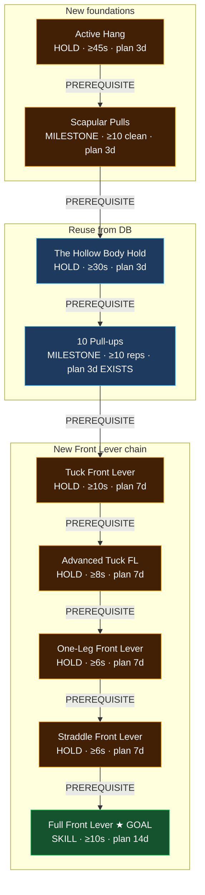
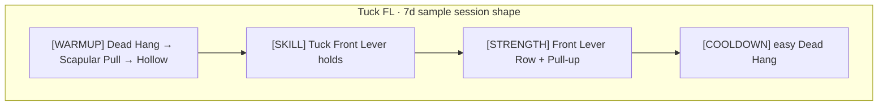
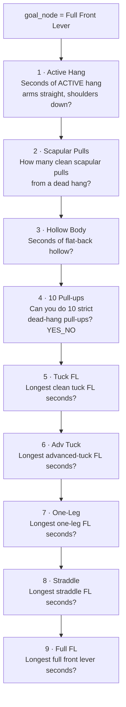
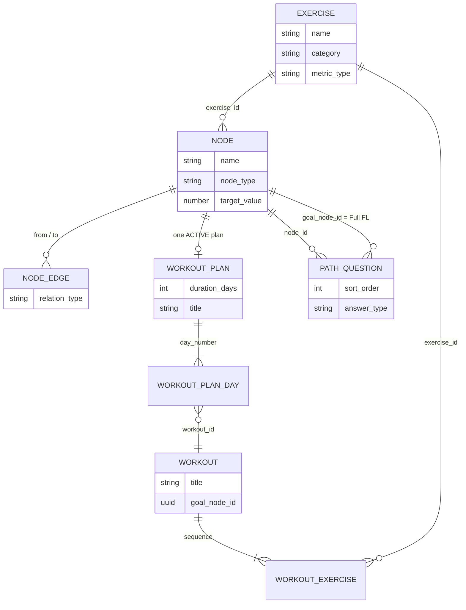

# Front Lever Path — Seed Blueprint

Static catalog data to seed into Calistrack so you can:

1. Answer placement questions genuinely
2. Land on a node
3. Train day-by-day via `workout_plan` → sessions
4. Verify the node → unlock next

**Status:** seeded into Neon via [`docs/04-data/seed-front-lever.sql`](../04-data/seed-front-lever.sql).

---

## Duration philosophy (best-case, consistent)

Foundations are short (pattern + tendon primer). Static skill holds get longer. Full FL is the consolidation block.

| #   | Node                       | Plan days | Notes                               |
| --- | -------------------------- | --------- | ----------------------------------- |
| 1   | Active Hang                | **3**     | Was 7 — too long for a hang gate    |
| 2   | Scapular Pulls             | **3**     | Motor pattern, not a strength cycle |
| 3   | Hollow Body Hold _(reuse)_ | **3**     | Short midline polish                |
| 4   | 10 Pull-ups _(reuse)_      | **3**     | Existing plan                       |
| 5   | Tuck Front Lever           | **7**     | First real FL isometric             |
| 6   | Advanced Tuck FL           | **7**     | Leverage jump                       |
| 7   | One-Leg Front Lever        | **7**     | Asymmetry + strength                |
| 8   | Straddle Front Lever       | **7**     | Open hips, hold level               |
| 9   | Full Front Lever ★         | **14**    | Peak skill + volume                 |

**Best-case total from zero:** 3+3+3+3+7+7+7+7+14 = **54 training days**  
(Placement skips nodes you already pass.)

---

## 1) Skill graph (`node` + `node_edge`)

### Edges to insert

| from                 | to                   |
| -------------------- | -------------------- |
| Active Hang          | Scapular Pulls       |
| Scapular Pulls       | The Hollow Body Hold |
| The Hollow Body Hold | 10 Pull-ups          |
| 10 Pull-ups          | Tuck Front Lever     |
| Tuck Front Lever     | Advanced Tuck FL     |
| Advanced Tuck FL     | One-Leg Front Lever  |
| One-Leg Front Lever  | Straddle Front Lever |
| Straddle Front Lever | Full Front Lever     |

> Hollow Body already has edges into the handstand path. Adding `Hollow → 10 Pull-ups` is fine (branch).  
> Walking ancestors of Full FL also sees the pull-up chain under 10 Pull-ups — placement questions below only cover the FL spine (same pattern as Muscle-Up questions).

---

## 2) Exercises (`exercise`)

| Name                      | Status                         | category | metric_type | difficulty   |
| ------------------------- | ------------------------------ | -------- | ----------- | ------------ |
| Dead Hang                 | REUSE                          | PULL     | TIME        | BEGINNER     |
| Scapular Pull             | REUSE                          | PULL     | REPS        | BEGINNER     |
| Hollow hold               | REUSE                          | CORE     | TIME        | INTERMEDIATE |
| Dead Bug                  | REUSE                          | CORE     | REPS        | BEGINNER     |
| Rows                      | REUSE                          | PULL     | REPS        | BEGINNER     |
| Pull-up                   | REUSE                          | PULL     | REPS        | INTERMEDIATE |
| Active Hang               | **NEW**                        | PULL     | TIME        | BEGINNER     |
| Tuck Front Lever          | **NEW**                        | STATIC   | TIME        | INTERMEDIATE |
| Advanced Tuck Front Lever | **NEW**                        | STATIC   | TIME        | INTERMEDIATE |
| One-Leg Front Lever       | **NEW**                        | STATIC   | TIME        | ADVANCED     |
| Straddle Front Lever      | **NEW**                        | STATIC   | TIME        | ADVANCED     |
| Full Front Lever          | **NEW**                        | STATIC   | TIME        | ELITE        |
| Front Lever Row           | **NEW**                        | PULL     | REPS        | INTERMEDIATE |
| Ice-Cream Maker           | **NEW** _(optional accessory)_ | PULL     | REPS        | ADVANCED     |

---

## 3) Nodes (`node`)

| Node                 | Status | node_type | Linked exercise           | target | unit | difficulty   |
| -------------------- | ------ | --------- | ------------------------- | ------ | ---- | ------------ |
| Active Hang          | NEW    | HOLD      | Active Hang               | 45     | sec  | BEGINNER     |
| Scapular Pulls       | NEW    | MILESTONE | Scapular Pull             | 10     | reps | BEGINNER     |
| The Hollow Body Hold | REUSE  | HOLD      | Hollow hold               | 30     | sec  | BEGINNER     |
| 10 Pull-ups          | REUSE  | MILESTONE | Pull-up                   | 10     | REPS | INTERMEDIATE |
| Tuck Front Lever     | NEW    | HOLD      | Tuck Front Lever          | 10     | sec  | INTERMEDIATE |
| Advanced Tuck FL     | NEW    | HOLD      | Advanced Tuck Front Lever | 8      | sec  | INTERMEDIATE |
| One-Leg Front Lever  | NEW    | HOLD      | One-Leg Front Lever       | 6      | sec  | ADVANCED     |
| Straddle Front Lever | NEW    | HOLD      | Straddle Front Lever      | 6      | sec  | ADVANCED     |
| Full Front Lever     | NEW ★  | SKILL     | Full Front Lever          | 10     | sec  | ELITE        |

---

## 4) Plans + day workouts overview

**Seed volume:** ~3+3+3+7+7+7+7+14 = **51 new plan-days** (+ reuse 10PU’s existing 3).

---

## 5) Day-by-day plans

### ① Active Hang — 3 days

| Day | Workout title                | Lines (seq → exercise · prescription)                                 |
| --- | ---------------------------- | --------------------------------------------------------------------- |
| 1   | Active Hang — Day 1          | 1 Dead Hang 3×20s · 2 Active Hang 4×15s · 3 Scapular Pull 2×8         |
| 2   | Active Hang — Day 2          | 1 Dead Hang 2×25s · 2 Active Hang 5×20s · 3 Scapular Pull 3×8         |
| 3   | Active Hang — Day 3 _(test)_ | 1 Active Hang aim 45s ×3 · 2 Scapular Pull 3×10 · 3 Hollow hold 2×15s |

### ② Scapular Pulls — 3 days

| Day | Workout title                   | Lines                                                            |
| --- | ------------------------------- | ---------------------------------------------------------------- |
| 1   | Scapular Pulls — Day 1          | 1 Dead Hang 2×20s · 2 Scapular Pull 4×8 · 3 Active Hang 2×20s    |
| 2   | Scapular Pulls — Day 2          | 1 Scapular Pull 5×10 · 2 Active Hang 3×25s · 3 Hollow hold 2×20s |
| 3   | Scapular Pulls — Day 3 _(test)_ | 1 Scapular Pull 3×10 clean · 2 Active Hang 2×30s · 3 Rows 3×10   |

### ③ Hollow Body Hold — 3 days _(new plan on existing node)_

| Day | Workout title           | Lines                                                         |
| --- | ----------------------- | ------------------------------------------------------------- |
| 1   | Hollow — Day 1          | 1 Dead Bug 3×8/side · 2 Hollow hold 4×15s · 3 Dead Hang 2×20s |
| 2   | Hollow — Day 2          | 1 Hollow hold 5×20s · 2 Dead Bug 3×10 · 3 Active Hang 2×25s   |
| 3   | Hollow — Day 3 _(test)_ | 1 Hollow hold aim 30s ×3 · 2 Scapular Pull 3×8 · 3 Rows 3×10  |

### ④ 10 Pull-ups — 3 days _(EXISTING plan — no change)_

Existing `10 pullups-3day plans` workouts stay as-is.

### ⑤ Tuck Front Lever — 7 days

| Day | Focus       | Skill + strength lines                                                                |
| --- | ----------- | ------------------------------------------------------------------------------------- |
| 1–2 | Learn shape | Warm: Dead Hang, Scap, Hollow · Skill: Tuck FL 5×6–8s · FL Row tuck 3×5 · Pull-up 3×5 |
| 3–4 | Volume      | Same warmup · Tuck FL 6×8–10s · FL Row 3×6 · Pull-up 3×6                              |
| 5–6 | Density     | Tuck FL 5×10–12s short rest · FL Row 3×6 · Rows 3×10                                  |
| 7   | Test        | Max clean Tuck FL holds toward **10s** · light accessory                              |

### ⑥ Advanced Tuck FL — 7 days

| Day | Focus          | Skill + strength lines                                              |
| --- | -------------- | ------------------------------------------------------------------- |
| 1–2 | Open the lever | Warm same · Adv Tuck 5×5–6s · Tuck FL maintenance 3×8s · FL Row 3×5 |
| 3–4 | Build          | Adv Tuck 6×6–8s · optional Ice-Cream Maker 3×4 easy · Pull-up 3×6   |
| 5–6 | Density        | Adv Tuck 5×8s · Tuck FL 2×10s · Rows 3×10                           |
| 7   | Test           | Max Adv Tuck toward **8s**                                          |

### ⑦ One-Leg Front Lever — 7 days

| Day | Focus     | Skill + strength lines                              |
| --- | --------- | --------------------------------------------------- |
| 1–2 | Both legs | One-Leg FL 4×4–5s /leg · Adv Tuck 3×6s · FL Row 3×5 |
| 3–4 | Build     | One-Leg 5×5–6s /leg · Adv Tuck 2×8s · Pull-up 3×5   |
| 5–6 | Density   | One-Leg 4×6s · light straddle openers · Rows 3×8    |
| 7   | Test      | Max One-Leg toward **6s** (weaker leg counts)       |

### ⑧ Straddle Front Lever — 7 days

| Day | Focus     | Skill + strength lines                                              |
| --- | --------- | ------------------------------------------------------------------- |
| 1–2 | Open hips | Straddle FL 5×4–5s · One-Leg maintenance 2×5s · FL Row straddle 3×4 |
| 3–4 | Build     | Straddle 5×5–6s · Adv Tuck 2×6s · Pull-up 3×5                       |
| 5–6 | Density   | Straddle 4×6s · One-Leg 2×5s · Rows 3×8                             |
| 7   | Test      | Max Straddle toward **6s**                                          |

### ⑨ Full Front Lever — 14 days

| Days  | Focus          | Skill + strength lines                                               |
| ----- | -------------- | -------------------------------------------------------------------- |
| 1–3   | First attempts | Full FL 6–8 short attempts · Straddle maintenance · FL Row 3×5       |
| 4–6   | Accumulate     | Full FL total ~8–12s/session in pieces · One-Leg / Straddle backoffs |
| 7–9   | Density        | Longer single holds · light Ice-Cream Maker if elbows happy          |
| 10–12 | Peak           | Full FL quality sets · pull volume kept easy                         |
| 13–14 | Test / polish  | Aim continuous **≥10s** clean full FL · then assessment video        |

Later nodes keep this template; only the `[SKILL]` exercise / leverage changes.

---

## 6) Placement questions (`path_question`)

Goal = **Full Front Lever**. One question per spine node (same style as Muscle-Up / Handstand goals).

| sort | node                 | prompt                                                                             | answer_type | pass if |
| ---- | -------------------- | ---------------------------------------------------------------------------------- | ----------- | ------- |
| 1    | Active Hang          | How many seconds can you hold an active hang (arms straight, shoulders depressed)? | REPS        | ≥ 45    |
| 2    | Scapular Pulls       | How many clean scapular pulls can you do from a dead hang?                         | REPS        | ≥ 10    |
| 3    | The Hollow Body Hold | How many seconds can you hold a flat-back hollow body continuously?                | REPS        | ≥ 30    |
| 4    | 10 Pull-ups          | Can you do 10 strict dead-hang pull-ups?                                           | YES_NO      | YES     |
| 5    | Tuck Front Lever     | What is your longest clean tuck front lever hold in seconds?                       | REPS        | ≥ 10    |
| 6    | Advanced Tuck FL     | What is your longest advanced-tuck front lever hold in seconds?                    | REPS        | ≥ 8     |
| 7    | One-Leg Front Lever  | What is your longest one-leg front lever hold in seconds?                          | REPS        | ≥ 6     |
| 8    | Straddle Front Lever | What is your longest straddle front lever hold in seconds?                         | REPS        | ≥ 6     |
| 9    | Full Front Lever     | What is your longest full front lever hold in seconds?                             | REPS        | ≥ 10    |

System places you on the first node you fail; that node’s plan Day 1 starts.

---

## 7) Entity relationship (what gets created)

---

## 8) Seed checklist counts

| Entity                      | Count                  |
| --------------------------- | ---------------------- |
| New exercises               | 6–8                    |
| New nodes                   | 7 (+ 2 reused)         |
| New `node_edge`             | 8                      |
| New `workout_plan`          | 8 (skip existing 10PU) |
| New plan-days / workouts    | **~51**                |
| `path_question` for Full FL | 9                      |
| Best-case calendar          | **~54 days** from zero |

---

## Seed applied

SQL file: [`docs/04-data/seed-front-lever.sql`](../04-data/seed-front-lever.sql)

Applied to Neon `calistrack-db` (idempotent `ON CONFLICT` where possible). Goal node id:

`22222222-2222-2222-2222-22222222f007` — **Full Front Lever**
